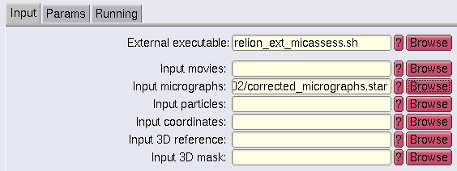
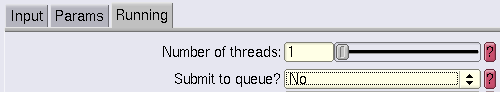

Quickstart Guide
----------------

## Steps

 * (Required) It is assumed that all imported movies or micrographs in
   the Relion project are in one folder and not in a complex EPU
   hierarchy.
 * Start any supported version of Relion in a new terminal, the
   *micassess* submission script uses its own environment without
   interference.
 * Go to **External** section at the bottom
 * As external executable enter **relion_ext_micassess.sh**
 * As input micrographs use a **Motioncorr** job result file like
   **corrected_micrographs.star**, both *float32* and *float16* micrographs
   are supported
 * At the **Running** tab disable cluster submission. Otherwise
   Relion will use the Relion template instead of the used *micassess*
   script.
 * Press **Run** and watch the logfiles until its finished.

When the script is done look at the Relion log window for something
like below. The section before * ### * is the output of *micassess*,
the lines afterwards come from postprocessing from my script. The list
of good micrographs contains the great ones.

    Found 433 images belonging to 1 classes.
    Found 433 images belonging to 1 classes.
    Total:	 433 micrographs
    0Great :	 83 micrographs
    1Decent :	 308 micrographs
    2Contamination_Aggregate_Crack_Breaking_Drifting :	 34 micrographs
    3Empty_no_ice :	 8 micrographs
    4Crystalline_ice :	 0 micrographs
    5Empty_ice_no_particles_but_vitreous_ice :	 0 micrographs
    19.17% of the micrographs are great and were written in the *_great.star file.
    90.30% of the micrographs are good and were written in the *_good.star file.
    Details can be found in the output directory.
    #####################################
    MicAssess: see the result preview images in: External/job015/MicAssess
    MicAssess: consider to delete the movies in: External/job015/movies_to_remove.txt to save disk space
    MicAssess: consider to use: External/job015/micrographs_micassessed.star for the next analysis step

So you can use as input for CTF jobs a pattern like:

    External/job015/micrographs_micassessed.star

This file is a modified version of the output file from the
motioncorrection job. So it contains all necessary values from
*Relion*, it just misses the micrographs and corresponding values
considered as *not good*.

## Preview the result via thumbnail images

Just go to the directory and start the filemanager. With doubleclicks
on a image you get the image viewer:

    cd External/job015/MicAssess
    thunar .

## Cleanup movies to save disk space

The script generates a list of TIFF movies not used, when you continue
with the **micrographs_micassessed.star** file you could consider to
remove them later from the storage or move them to an archive space.

    cd External/job015
    for i in $(cat movies_to_remove.txt); do find /where_your_movie_topfolder_is/ -name $i; done

If you are think you have the correct movies and not links to a
different location you can *REALLY DELETE* them like:

    for i in $(cat movies_to_remove.txt); do find /where_your_movie_topfolder_is/ -name $i -delete; done

Or you can move them to an *ARCHIVE SPACE* like:

    mkdir /dcache/wherever_my_movies
    for i in $(cat movies_to_remove.txt); do find /where_your_movie_topfolder_is/ -name $i -exec mv -v {} /dcache/wherever_my_movies \; ; done

